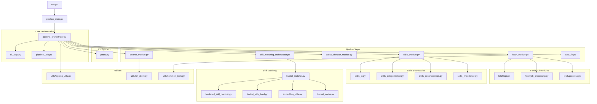

# Pipeline Workflow Diagram

## Pipeline Execution Flow

1. **Entry Point**: `run.py` calls `pipeline_main.py`
2. **Argument Parsing**: `pipeline_main.py` uses `cli_args.py` to parse arguments
3. **Pipeline Orchestration**: `pipeline_orchestrator.py` coordinates all pipeline steps
4. **Step 1 - Fetch Jobs**: `fetch_module.py` retrieves job data from the API
5. **Step 2 - Clean Descriptions**: `cleaner_module.py` cleans and formats job descriptions
6. **Step 3 - Check Status**: `status_checker_module.py` checks if jobs are still available online
7. **Step 4 - Process Skills**: `skills_module.py` extracts and processes skills
8. **Step 5 - Match Skills**: `skill_matching_orchestrator.py` matches skills using the bucketed approach
9. **Step 6 - Auto Fix**: `auto_fix.py` fixes jobs with missing skills or zero matches

Each step has dependencies on various utility modules and submodules as shown in the diagram.
