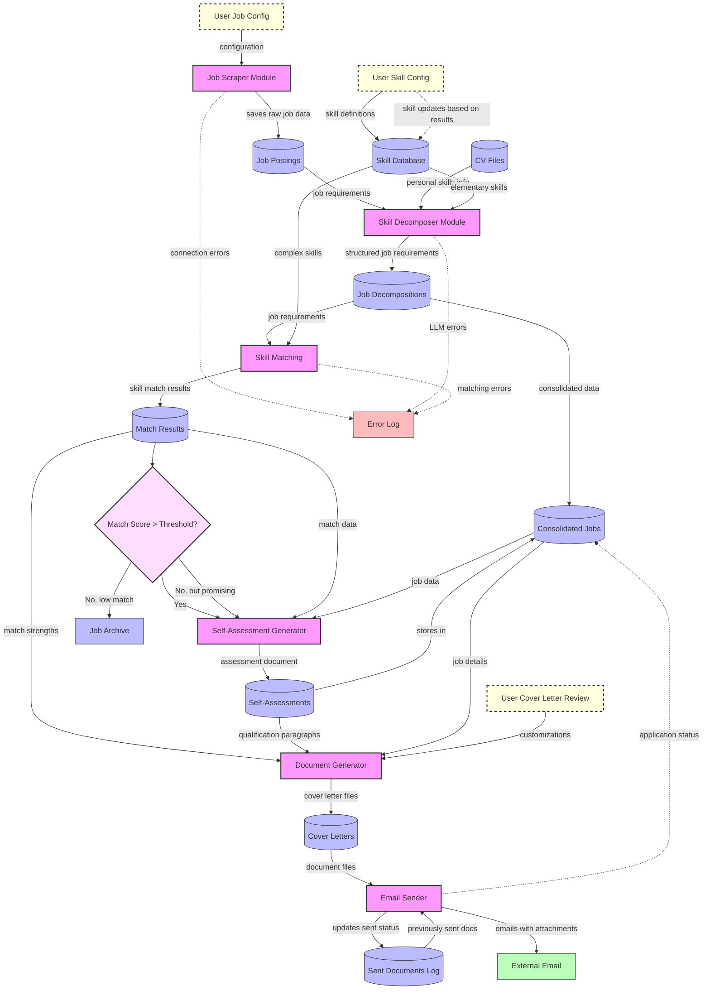
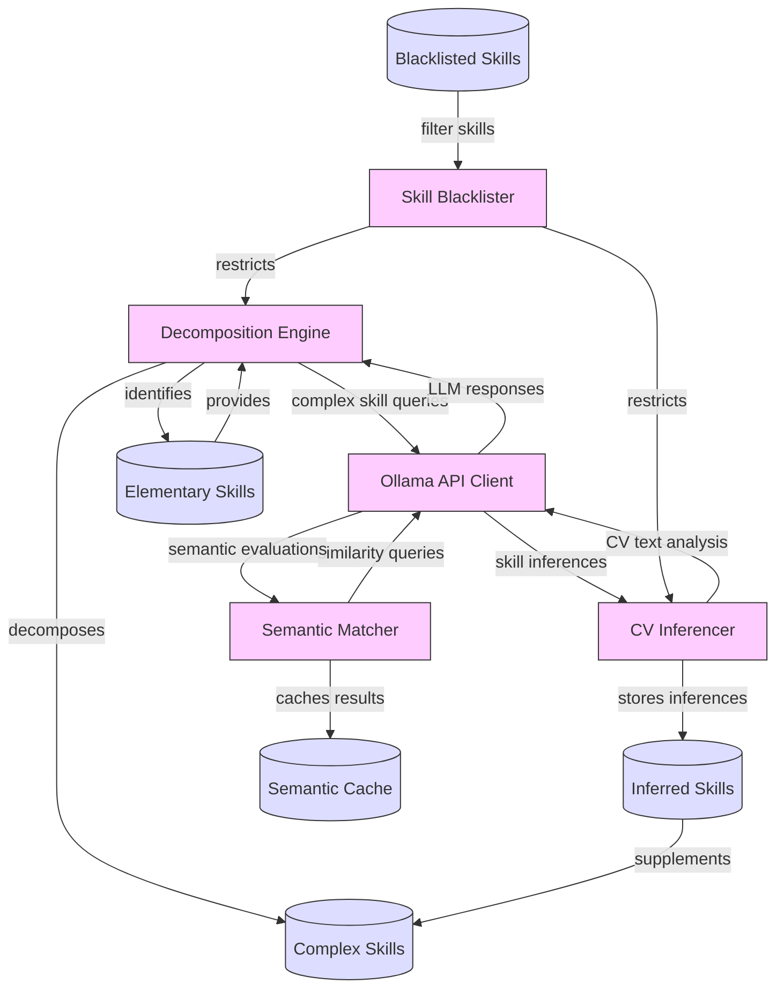
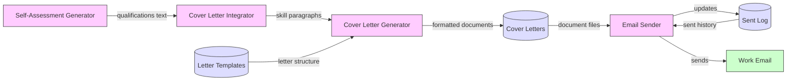

# Project Sunset - System Data Flow

This document visualizes the data flow through the job application automation system.

## Overall System Data Flow (Improved)

## Detailed Module Data Flows

### Job Scraper Module

```mermaid
flowchart LR
    %% Components
    fetch[Job Fetcher]
    extract[Job Detail Extractor]
    process[Job Processor]
    reporter[Report Generator]
    
    %% Data Stores
    apiResponse[(API Response)]
    jobFiles[(Job JSON Files)]
    reportFiles[(Report Files)]
    
    %% Flow
    fetch -->|raw job listings| apiResponse
    apiResponse -->|job IDs & URLs| extract
    extract -->|detailed job info| process
    process -->|structured job data| jobFiles
    jobFiles --> reporter
    reporter -->|summary reports| reportFiles

    %% Styling
    classDef component fill:#fcf,stroke:#333,stroke-width:1px;
    classDef store fill:#ddf,stroke:#333,stroke-width:1px;
    
    class fetch,extract,process,reporter component;
    class apiResponse,jobFiles,reportFiles store;
```

### Skill Decomposer Module

### Document Generation & Email Module

## Key File Relationships

```mermaid
flowchart TD
    %% Key Files
    jobPostings["/data/postings/*.json"]
    jobDecomps["/data/job_decompositions/*.json"]
    matches["/data/job_decompositions/*_matches.json"]
    consolidated["/data/consolidated_jobs/*.json"]
    elemSkills["/profile/skills/elementary_skills.json"]
    compSkills["/profile/skills/skill_decompositions.json"]
    inferSkills["/profile/skills/inferred_skills.json"]
    blacklist["/profile/skills/skill_blacklist.json"]
    semCache["/data/semantic_similarity_cache.json"]
    cvFiles["/profile/cv/*"]
    templates["/templates/cover_letter_template.md"]
    coverLetters["/docs/cover_letters/*"]
    sentLog["/data/logs/sent_documents_log.json"]
    
    %% Relationships
    scraper[scraper.py] -->|outputs| jobPostings
    
    processor[process_job.py] -->|reads| jobPostings
    processor -->|writes| jobDecomps
    processor -->|writes| matches
    processor -->|writes| consolidated
    
    decomposer[decomposition.py] -->|reads & writes| elemSkills
    decomposer -->|reads & writes| compSkills
    
    cvInfer[cv_inference.py] -->|reads| cvFiles
    cvInfer -->|writes| inferSkills
    
    matchingEngine[matching.py] -->|reads| matches
    matchingEngine -->|reads| compSkills
    matchingEngine -->|reads| elemSkills
    matchingEngine -->|reads| inferSkills
    matchingEngine -->|reads| blacklist
    
    semantics[semantics.py] -->|reads & writes| semCache
    
    assessment[generator.py] -->|reads| matches
    assessment -->|reads| consolidated
    assessment -->|writes| consolidated
    
    coverGen[generate_cover_letter.py] -->|reads| templates
    coverGen -->|reads| consolidated 
    coverGen -->|reads| matches
    coverGen -->|writes| coverLetters
    
    emailSender[email_sender.py] -->|reads| coverLetters
    emailSender -->|reads & writes| sentLog

    %% Styling
    classDef script fill:#f9d,stroke:#333,stroke-width:1px;
    classDef datafile fill:#9df,stroke:#333,stroke-width:1px;
    
    class scraper,processor,decomposer,cvInfer,matchingEngine,semantics,assessment,coverGen,emailSender script;
    class jobPostings,jobDecomps,matches,consolidated,elemSkills,compSkills,inferSkills,blacklist,semCache,cvFiles,templates,coverLetters,sentLog datafile;
```

